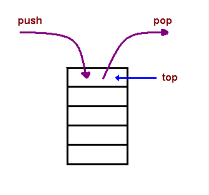

# Understanding the JavaScript Call Stack

1. What is a ‘call’?

  call stack: is a data structure that uses the Last In, First Out (LIFO) principle to temporarily store and manage a function call (call).

2. How many ‘calls’ can happen at once?

The call stack is mainly used to invoke the function (call). Since the call stack is single, the function(s) are executed, one by one, from top to bottom. This means that the call stack is synchronous.

3. What does LIFO mean?

LIFO: When we say that the call stack, operates according to the data structure principle of Last In, First Out, it means that the last function pushed into the stack is the first function to exit, when the function returns.

4. Draw an example of a call stack and the functions that would need to be invoked to generate that call stack.

5. What causes a Stack Overflow?

A stack overflow occurs when there is an iterative function (a function that calls itself) without an exit point. The browser (hosting environment) has the maximum invocation of the stack it can hold before throwing the stack fault.

# JavaScript error messages

1. What is a ‘refrence error’?

In JavaScript, a reference error is thrown when the code tries to reference a variable that does not exist.

2. What is a ‘syntax error’?

An exception caused by incorrect use of a predefined syntax. Syntax errors were detected while compiling or parsing the source code. For example, if you leave a closing brace (}) when defining a JavaScript function, you are triggering a syntax error.

3. What is a ‘range error’?

Describe. RangeError is thrown when trying to pass a value as an argument to a function that does not allow a range to include the value. This can be encountered when: Passing a non-allowable string value to String.

4. What is a ‘tyep error’?

The TypeError object represents an error when the operation cannot be performed, usually (but not exclusively) when the value is not of the expected type. A TypeError may be thrown when: The operand or argument passed to a function is incompatible with the type that that operator or function expects.

5. What is a breakpoint?

At each breakpoint, the JavaScript will stop executing, and let you check the JavaScript values. After checking the values, you can resume executing the code (usually with the play button).

6. What does the word ‘debugger’ do in your code?

The debugger keyword stops execution of JavaScript, and calls (if any) the debug function. This has the same function as setting a breakpoint in the debugger. ... With the debugger running, this code will stop executing before it executes the third line.