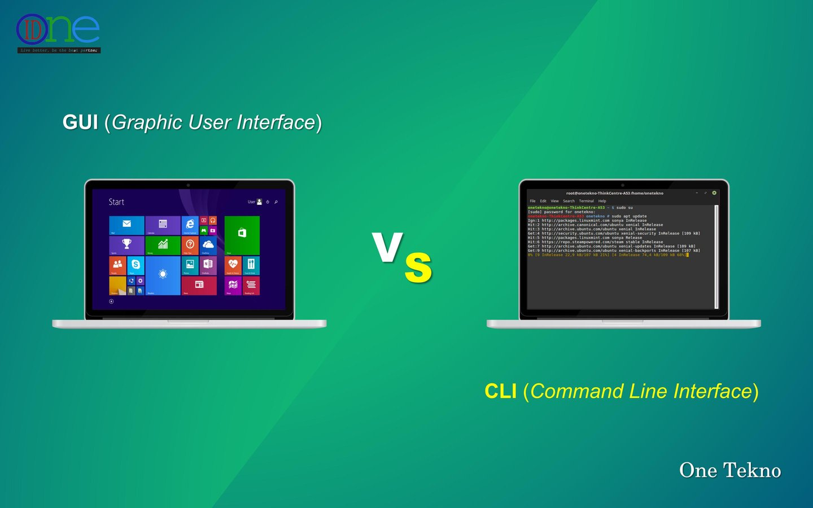
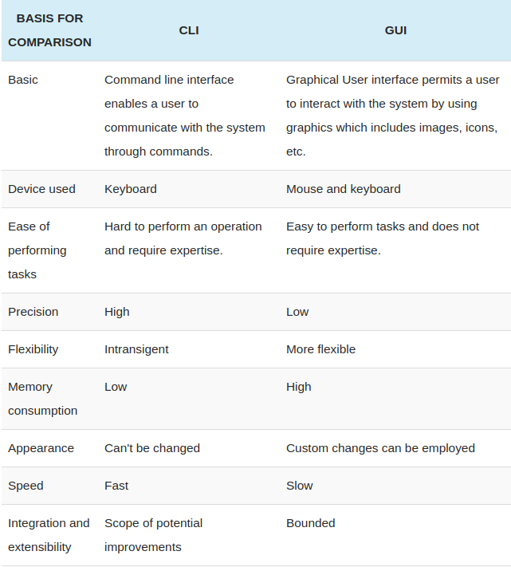

# What I laern to day
1. GUI
2. CLI
3. Git

## GUI:
**Graphical User Interface**: Makes use of computer graphics. It allows the user to interact with the computer using components such as windows, icons, labels, text boxes, and radio buttons. It is easy for the user to perform the tasks using the GUI as it does not require remembering the commands. He can easily click icons and drag and drop objects with the mouse.

***Operating systems** such: as Windows and Linux provide a graphical user interface. It contains windows, icons, search boxes, menus, drop-down lists, and many graphical elements. There is also an application software designed for specific business requirements such as human resource management systems, library management systems, etc. It consists of graphical user interfaces to accomplish the necessary tasks. In general, the GUI is an easy-to-use mechanism for interacting with the system.
## CLI
**Command Line Interface** *(CLI)* is also called a command language interpreter, console user interface, or character user interface. It allows users to enter commands into the device to perform the task. When the user enters a command and presses the 'enter' key, the terminal or shell will interpret that command and display the response back to the terminal. Similarly, the user can communicate with the operating system.

The user should have a good understanding to use the CLI. He should thoroughly know the correct syntax to issue effective commands. Operating systems such as UNIX contains a CLI while OS such as Windows and Linux contains both CLI and GUI. Overall, CLI is memory efficient 
and faster in execution than the GUI.

### Difference Between GUI and CLI

# What is Git:

**Git:** is a free and open source distributed version control system designed to handle everything from small to very large projects with speed and efficiency. Git is easy to learn and has a tiny footprint with lightning fast performance. It outclasses SCM tools like Subversion, CVS, Perforce, and ClearCase with features like cheap local branching, convenient staging areas, and multiple workflows.

## Some of command I learn to day:
* Git Push
* Git Pull
* Git Status
* Git Add
* Git Commit

** For more information and commadn click **
[here Link](https://zepel.io/blog/13-git-commands/)