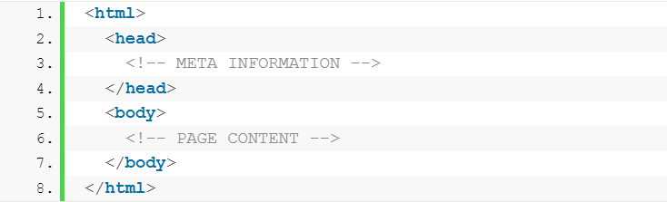
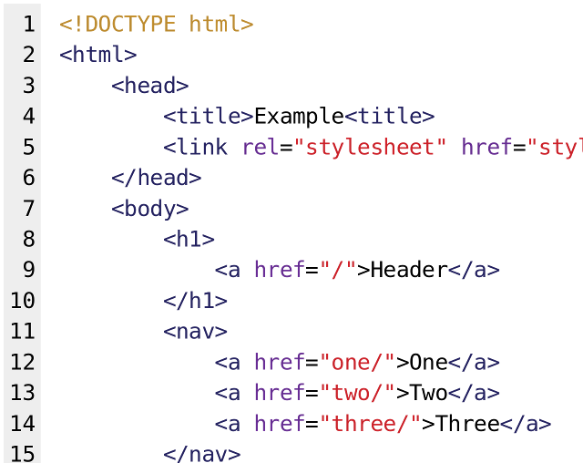

# HTML 
**Hypertext Markup Language:** (HTML) is a computer language that makes up most web pages and online applications. A hypertext is a text that is used to reference other pieces of text, while a markup language is a series of markings that tells web servers the style and structure of a document. HTML is not considered a programming language as it can’t create dynamic functionality. Instead, with HTML, web users can create and structure sections, paragraphs, and links using elements, tags, and attributes. 

Here are some of the most common uses for HTML:
* Web development.
* Internet navigation.
* Web documentation.

## How Does HTML Work
The average website includes several different HTML pages. For instance, a home page, an about page, and a contact page would all have separate HTML files. HTML documents are files that end with a .html or .htm extension. A web browser reads the HTML file and renders its content so that internet users can view it. All HTML pages have a series of HTML elements, consisting of a set of tags and attributes. HTML elements are the building blocks of a web page. A tag tells the web browser where an element begins and ends, whereas an attribute describes the characteristics of an element. 

The three main parts of an element are: 
* Opening tag
* Content
* Closing tag

## Block-Level Elements
A block-level element takes up the entire width of a page. It always starts a new line in the document. For example, a heading element will be in a separate line from a paragraph element.

Every HTML page uses these three tags:
* html tag: is the root element that defines the whole HTML document.
* head tag: holds meta information such as the page’s title and charset.
* body tag: encloses all the content that appears on the page.

** Example:**

Other popular block-level tags include:

* Heading tags: these range from (h1) to (h6), where heading h1 is largest in size, getting smaller as they move up to (h6). 
* Paragraph tags – are all enclosed by using the (p) tag.
* List tags – have different variations. Use the (ol) tag for an ordered list, and use (ul) for an unordered list. Then, enclose individual list items using the (li) tag.

** Example:**

# For more information in HTML click in [this Link](https://www.hostinger.com/tutorials/what-is-html) 