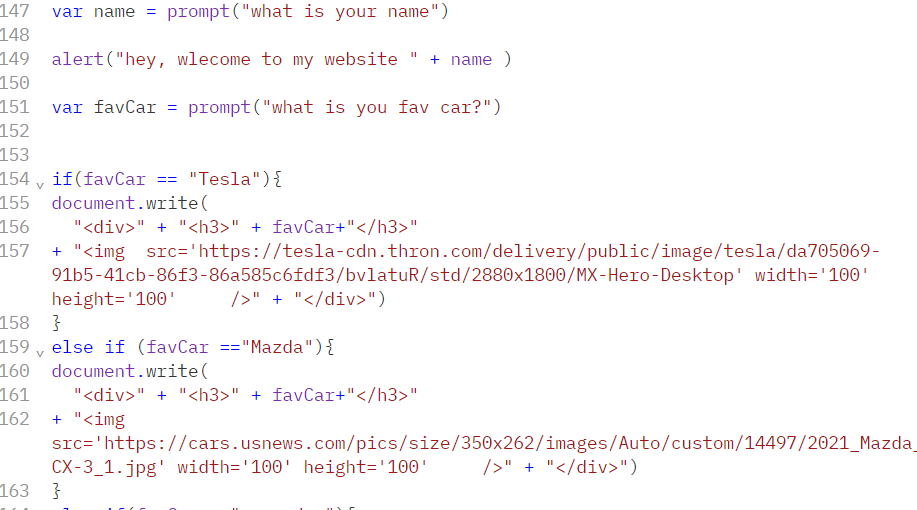

# JavaScript 
**JavaScript:** *(JS)* is a scripting or programming language that allows you to implement complex features on web pages — every time a web page does more than just sit there and display static information for you to look at — displaying timely content updates, interactive maps, animated 2D/3D graphics, scrolling video jukeboxes, etc. — you can bet that JavaScript is probably involved. It is the third layer of the layer cake of standard web technologies, two of which (HTML and CSS) we have covered in much more detail in other parts of the Learning Area.

## What is happen or doing when you use JavaScript on your page?
Let's briefly recap the story of what happens when you load a web page in a browser. When you load a web page in your browser, you are running your code (the HTML, CSS, and JavaScript) inside an execution environment (the browser tab). that takes your code and outputs a product (the web page).

### Example code:
