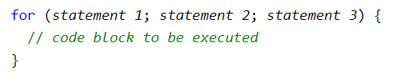
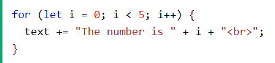
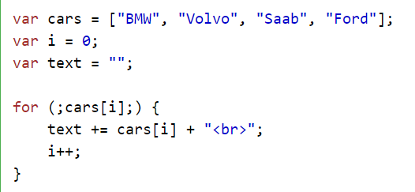
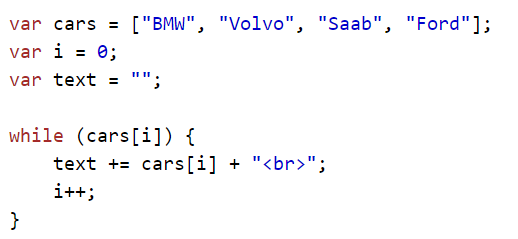

 
 # Loops:
 Loops are handy, if you want to run the same code over and over again, each time with a different value.

 ## Different Kinds of Loops
JavaScript supports different kinds of loops:

* **for - loops** through a block of code a number of times.
* **while - loops** through a block of code while a specified condition is true.

### The For Loop
The for loop has the following syntax:

- **Statement 1:** is executed (one time) before the execution of the code block.

- **Statement 2:** defines the condition for executing the code block.

- **Statement 3:** is executed (every time) after the code block has been executed.

#### For example:

# While Loop
The while loop loops through a block of code as long as a specified condition is true.

## Syntax

while (condition) {

  // code block to be executed
  
}

# Comparing For and While
the while loop is much the same as a for loop, with statement 1 and statement 3.
### example:

The loop in this example uses a for loop to collect the car names from the cars array:

The loop in this example uses a while loop to collect the car names from the cars array:
