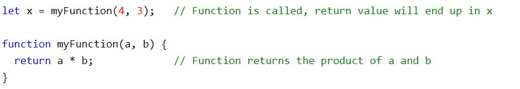

# Functions:
A JavaScript function is a block of code designed to perform a particular task. A JavaScript function is executed when "something" invokes it (calls it).

## Function Syntax:
A JavaScript function is defined with the function keyword, followed by a name, followed by parentheses (). Function names can contain letters, digits, underscores, and dollar signs (same rules as variables). The parentheses may include parameter names separated by commas:
(parameter1, parameter2)
The code to be executed, by the function, is placed inside curly brackets: {}

**function name(parameter1, parameter2, parameter3) {**
  
  **// code to be executed**

**}**

Function parameters are listed inside the parentheses () in the function definition. Function arguments are the values received by the function when it is invoked. Inside the function, the arguments (the parameters) behave as local variables.

### Function Invocation:
The code inside the function will execute when "something" invokes (calls) the function:
- When it is invoked (called) from JavaScript code
- Automatically (self invoked)

# Function Return
When JavaScript reaches a return statement, the function will stop executing. If the function was invoked from a statement, JavaScript will "return" to execute the code after the invoking statement. Functions often compute a return value. The return value is "returned" back to the "caller":

#### example:

# Operators:
An operator is capable of manipulating a certain value or operand. Operators are used to perform specific mathematical and logical computations on operands. In other words, we can say that an operator operates the operands. In JavaScript operators are used for compare values, perform arithmetic operations like:
- The assignment operator (=) assigns a value to a variable.
- The addition operator (+) adds numbers:
- The multiplication operator (*) multiplies numbers.
JavaScript Arithmetic Operators

