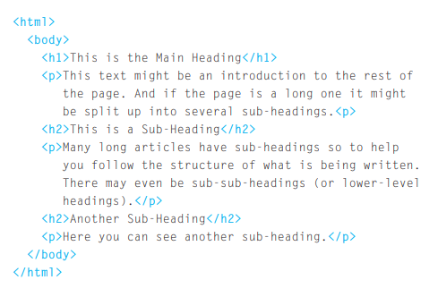
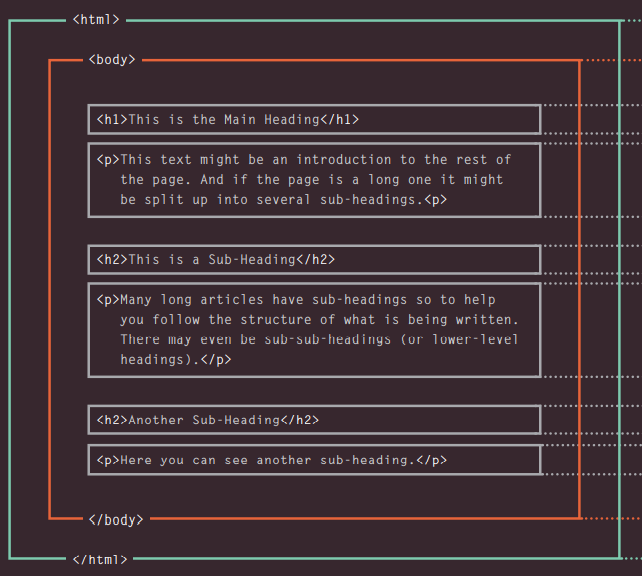
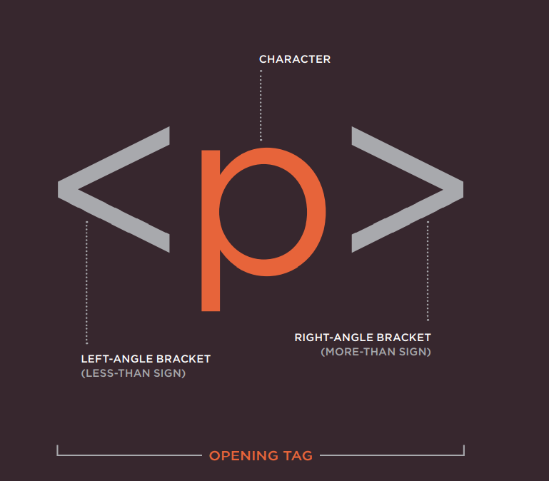
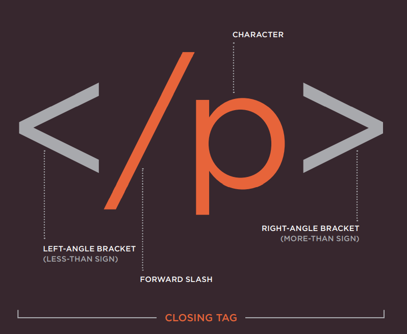
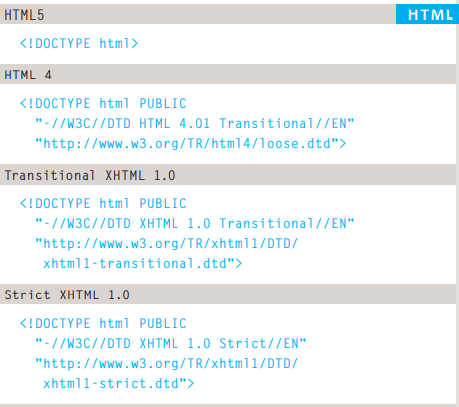
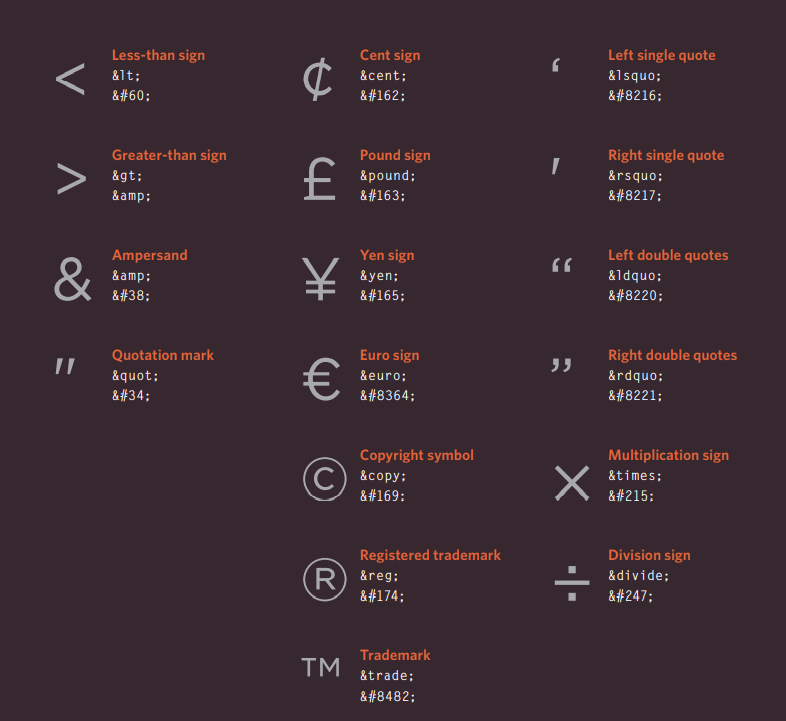
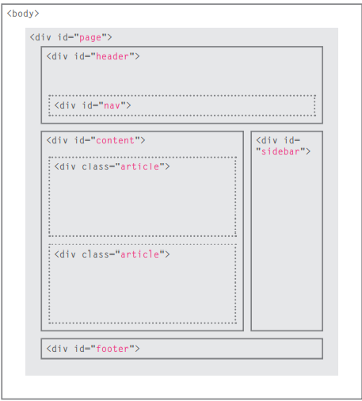
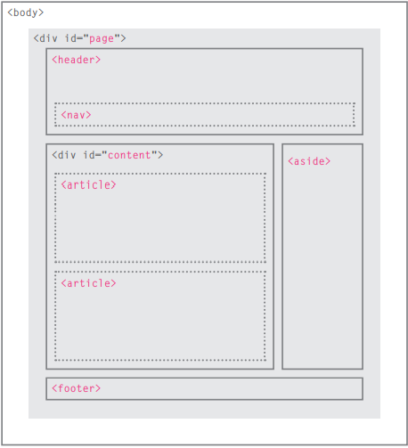
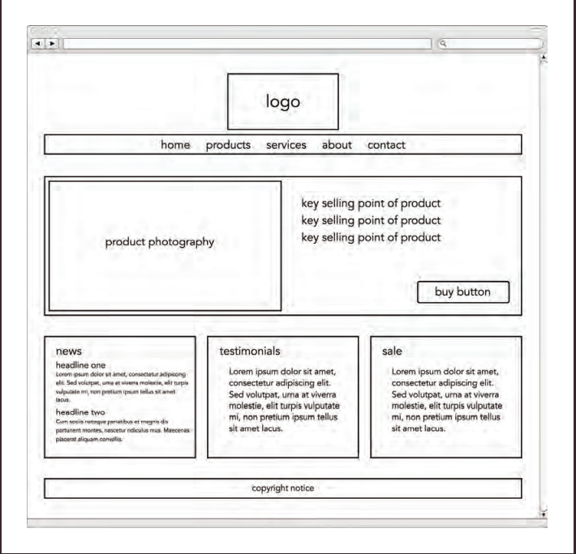

#  Introductory HTML and JavaScript

## What is html 
**HTML :** is the standard markup language for creating Web pages. 

We'll spend on this page looking at how HTML is used to create web pages. You will see that you start typing the words you want to appear on your page. You can then add tags or elements to the words so the browser knows what the title is, where the paragraph begins and ends, etc. The rest of this section presents the tags you have at your disposal to create web pages grouped into this page containing: text, menus, links, images, tables, forms, audio and flash video, and miscellaneous items.

### How People Access the Web:
* **Browsers :** People access websites using software called a web browser. Popular examples include Firefox, Internet  Explorer, Safari, Chrome, and Opera.
* **Web Servers:** When you ask your browser for a web page, the request is sent across the Internet to a special computer known as a web server which hosts the website.
* **Screen readers:** Screen readers are programs that read out the contents of a computer screen to a user. They are commonly used by people with visual impairments.
* **Devices:** People are accessing websites on an increasing range of devices including desktop computers, laptops, tablets, and mobile phones.

### How HTML Describes the Structure of Pages:
The HTML code is describes by (in blue) is made up of characters that live inside angled  brackets — these are called HTML elements. Elements are usually made up of two tags: an opening tag and a closing tag. (The closing tag has an extra forward slash in it.) Each HTML element tells the browser  something about the information that sits between its opening and  closing tags.

### HTML Uses Elements to Describe the  Structure of Pages like:

### A Closer Look at Tags it's like:

## Body, Head & Title tags:
* **Body :** You met the (body) element  in the first example we created. Everything inside this element is shown inside the main browser window
* **Head :** Before the (body) element you  will often see a (head) element. This contains information about the page (rather than  information that is shown within the main part of the browser window that is highlighted in blue on the opposite page). You will usually find a (title) element inside the (head) element
* **Title :** The contents of the (title) element are either shown in the  top of the browser, above where  you usually type in the URL of  the page you want to visit, or  on the tab for that page (if your  browser uses tabs to allow you to view multiple pages at the same time)

### The history of HTML
* HTML 4 Released 1997
* XHTML 1.0 Released 2000
* HTML5 Released 2000

#### DOCTYPEs example for all version:

#### **Comments Example**

**ID Attribute :** Every HTML element can carry  the id attribute. It is used to uniquely identify that element  from other elements on the  page. Its value should start with  a letter or an underscore (not a number or any other character). It is important that no two elements on the same page  have the same value for their id attributes (otherwise the value is  no longer unique.

**Class Attribute :** Every HTML element can also carry a class attribute. Sometimes, rather than uniquely identifying one element within a document, you will want a  way to identify several elements as being different from the other elements on the page. For example, you might have some paragraphs of text that contain information that is more important than others and want to distinguish these elements, or  you might want to differentiate between links that point to other pages on your own site and links that point to external sites.

**Block Elements :** Some elements will always appear to start on a new line in the browser window. These are known as block level elements.
**Some tags:**
* div : The (div) element allows you to group a set of elements together  in one block-level box
* span : The (span) element acts like  an inline equivalent of the (div) element. It is used to either:
     1. Contain a section of text  where there is no other suitable element to differentiate it from its surrounding text
     2. Contain a number of inline elements

* iframe : An iframe is like a little window that has been cut into your page—and in that window you can see another page. The term  iframe is an abbreviation of inline frame.

meta : The (meta) element lives  inside the (head) element and contains information about that web page.

### Escape Characters:

**Traditional HTML Layouts :** For a long time, web page authors used (div) elements to group together related elements on the page (such as the elements that form a header, an article, footer or sidebar). Authors used class or id attributes to indicate the role of the (div) element in the structure of the page.

 but HTML5 introduces a new set of elements that allow you to divide up the parts of a page. The names of these elements indicate the kind of content you will find in them. They are still subject to change, but that has not  stopped many web page authors using them already.
 

 * Headers & Footers: The (header) and (footer) elements can be used for:
     * The main header or footer  that appears at the top or  bottom of every page on the  site.
     
     * A header or footer for an individual (article) or  (section) within the page

     ### WireFrames:
     A wireframe is a simple sketch of the key information that needs to go on each page of a site. It shows the hierarchy of the information and how much space it might require.
     
 
 Design is about communication. Visual hierarchy helps visitors understand what you are trying to tell them. (X) You can differentiate between pieces of information  using size, color, and style.  (X) You can use grouping and similarity to help simplify the information you present

 # JavaScript
 ## A SCRIPT IS A SERI ES OF INSTRUCTIONS:
 A script is a series of instructions that a computer can follow to achieve a goal. You would compare scripts to any of the following:
 * RECIPES
 * HANDBOOKS
 * MANUALS

 **WRITING A SCRIPT :** To write a script, you need to first state your goal and then list the tasks that need to be completed in order to achieve it.

 Computers approach tasks in a different way than humans, so your instructions must let the computer solve the task prggrammatically. To approach writing a script, break down your goal into a series of tasks and then work out each step needed  to complete that task (a flowchart can help).

 It is best to keep JavaScript code in its own JavaScript  file. JavaScript files are text files (like HTML pages and  CSS style sheets), but they have the . j s extension.  The HTML (script) element is used in HTML pages  to tell the browser to load the JavaScript file (rather like the (link) element can be used to load a CSS file). If you view the source code of the page in the browser, the JavaScript will not have changed the HTML, because the script works with the model of the web  page that the browser has created.