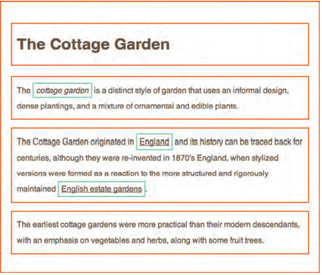
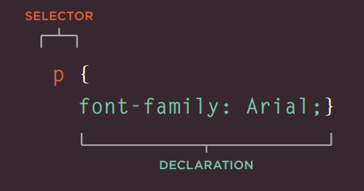
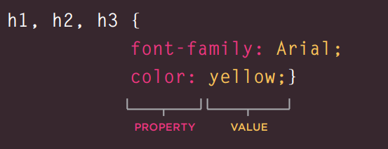

# Basics of HTML, CSS & JS
## HTML
**Headings:**

HTML has six "levels" of headings: (h1) used for headlines (h2) used for sub-headings If there are other sections under sub-headings, an element (h3) is used and so on. Browsers display the contents of titles in different sizes. The contents of element (h1) are the largest, and the contents of element (h6) are the smallest. The exact size at which each browser displays addresses can vary slightly. Users can also adjust the text size in their browser. You will see how to control the text size and color and the fonts used when we look at CSS. like:
* h1
* h2
* h3
* h4
* h5
* h6

**Paragraphs :** To create a paragraph, surround the words that make up the paragraph with an opening tag (p) and a closing tag (/p).

**Bold & Italic:**
* Bold: By including the words in (b) and (/b) we can make the letters appear in bold.
* Italic: By including words in the tags (i) and (/i) we can make characters appear italic.
### Visual Editors and Their Code views
Content management systems and HTML editors such as Dreamweaver usually have two views of the page you are creating: a visual editor and a code view.

### Semantic Markup
There are some text elements that are not intended to affect the structure of your web pages, but add additional information to the pages - known as semantic markup.like:
* **Strong & Emphasis:**
   * Strong:The use of the (strong) element indicates that its content is of great importance. For example, the words in this item can be said with intense focus
   * Emphasis: The element (em) indicates the emphasis that subtly changes the meaning of the sentence.

HTML elements are used to describe the structure of a page (such as headings, subheadings, and paragraphs). They also provide semantic information (eg, where to focus, definition of any abbreviations used, when given text is a quote)

# CSS
Understanding CSS: The key to understanding how CSS works is to imagine that there is an invisible box around every HTML element.

Block and Inline Elements: CSS lets you create rules that control how each individual box (and the contents of that box) is displayed.

CSS works by attaching rules to HTML elements. These rules control how the content of selected items is displayed. A CSS rule has two parts: a selector and a declaration

and CSS declarations are enclosed in square brackets and each consists of two parts: a property and a value, separated by a colon. You can specify multiple properties in one declaration, each separated by a semicolon.

### Using External CSS:
The (link) element can be used in an HTML document to tell the browser where to find the CSS file used to design the page. It's an empty element (i.e. it doesn't need a closing tag), and it lives inside the (head) element. You must use three attributes:
* href: This specifies the path to the CSS file (which is often placed in a folder called css or styles).
* Type: This attribute specifies the type of document it is associated with. The value should be text/css.
* rel: Defines the relationship between the HTML page and its associated file. The value must be a stylesheet when linking to a CSS file
### Internal CSS:
Style: You can also embed CSS rules within an HTML page by placing them inside a (style) element, which is usually located inside the page (header) element.

CSS treats each HTML element as if it appears inside its own box and uses rules to indicate what that element should look like. Rules consist of selectors (which specify which elements the rule applies to) and declarations (which indicate what those elements should look like). Different types of selectors allow you to target your rules at different items. Declarations consist of two parts: the properties of the item you want to change, and the values ​​for those properties. For example, the font-family property specifies the font choice, and the arial value specifies Arial as the preferred font. CSS rules usually appear in a separate document, although they may appear within an HTML page

# java
**STATEMENTS** : Text is a series of instructions that a computer can follow one by one. Each individual instruction or step is known as a statement. Phrases must end with a semicolon.

**Comments:** You should write comments to explain what your code does. It helps make your code easier to read and understand. This can help you and others who have read your code.

**Variable:** The script must cache the bits of information it needs to do its work. It can store this data in variables.A variable is a good name for this  concept because the data stored  in a variable can change (or vary)  each time a script runs. 

### DATA TYPES 
JavaScript distinguishes between numbers,  strings, and true or false values known as  Booleans. 

**ARRAYS :** An array is a special type of variable. It doesn't just store one value; it stores a list of values.

A script is made up of a series of statements. Each  statement is like a step in a recipe. Scripts contain very precise instructions. For example,  you might specify that a value must be remembered before creating a calculation using that value.  Variables are used to temporarily store pieces of  information used in the script. Arrays are special types of variables that store more  than one piece of related information.  JavaScript distinguishes between numbers (0-9),  strings (text), and Boolean values (true or false). Expressions evaluate into a single value.  Expressions rely on operators to calculate a value.

Conditional statements allow your code to make  decisions about what to do next.  Comparison operators (===, ! ==, ==, ! =, <, >, <=, =>)  are used to compare two operands.  Logical operators allow you to combine more than one  set of comparison operators.  if ... else statements allow you to run one set of code  if a condition is true, and another if it is false. 

### Switch statements: 
The switch statement begins with a variable called switch value. Each case indicates a possible value for that variable and the code to run if the variable matches that value.

Use of switch statements: the purpose of the switch statement is to present a different message to the user depending on which level they are on. The message is stored in a variable called msg, and the variable called leve 1 contains a number that indicates what level the user is at. This is then used as the switch value. (The switch value can also be an expression.)
