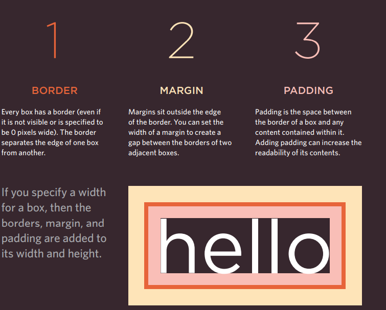
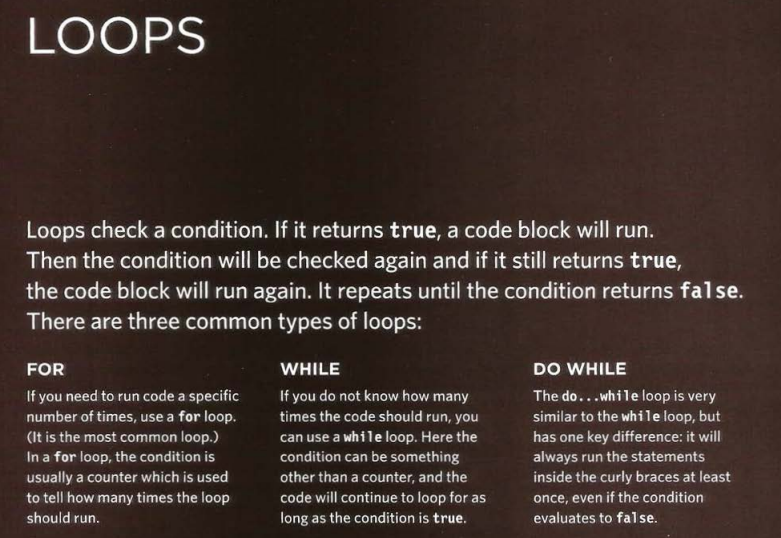

# Lists
There are lots of occasions when we need to use lists. HTML provides us with  three different types:
* Ordered Lists:
   
   * (ol) The ordered list is created with the (ol) element.
   * (li) Each item in the list is placed between an opening (li) tag  and a closing (/li) tag. (The li stands for list item.) Browsers indent lists by default.

* Unordered ListS:

  * (ul) The unordered list is created with the (ul) element. 
  * (li) Each item in the list is placed between an opening 
(li) tag and a closing (/li) tag. (The li stands for list item.) Browsers indent lists by default.

There are three types of HTML lists: ordered, unordered, and definition. Ordered lists use numbers. Unordered lists use bullets. Definition lists are used to define terms. Lists can overlap each other.

# Boxes
At the beginning You can set several properties that affect the appearance of  these boxes.

* Box Dimensions (width, height): By default, the box size is large enough to hold its contents. To set your own dimensions for a box, you can use the Height and Width properties.
*Limiting Width (min-width, max-width): Some page designs expand and contract to fit the user's screen size. In such designs, the min-width property specifies the smallest size a box can be displayed when the browser window is narrow, and the max-width property indicates the maximum width that a box can extend when the browser window is wide.

CSS treats each HTML element as if it had its own box. You can use CSS to control the dimensions of the box, and you can also control the borders, margin, and padding of each box with CSS. It is possible to hide items using the display and visibility properties. Block-level boxes can be made into inline boxes, and inline boxes can be made into block-level boxes. Legibility can be improved by controlling the width and spacing of boxes containing text. CSS3 introduced the ability to create image borders and rounded borders.

# Array 
An array is a special type of variable. It doesn't 
just store one value; it stores a list of values. 
### CREATING AN ARRAY
You create an array and name it just as you would any other variable (using the var keyword followed by the array name). The values for the array are set inside a pair of square brackets, and each value is separated by a comma. The values in the array don't have to be of the same data type, so you can store String, Number and Boolean all in the same array 

Values in an array are accessed as if they are in  a numbered list. It is important to know that the numbering of this list starts at zero (not one). 

Arrays are special types of variables that store more than one piece of related information. JavaScript distinguishes between numbers (0-9), strings (text), and Booleans (true or false). Expressions are evaluated in a single value. Expressions depend on operators to calculate the value.

#  LOOP

### FOR LOOPS
The for loop is often used to iterate through the elements in an array. In this example, the scores for each test round are stored in an array called Scores.
### WHILE LOOPS
Here is an example of a while loop. Write table 5 times. Each time the loop runs, another arithmetic operation is written into the variable called msg. And There are three types of loop: for, while, and do ... while. Each repeats a set of statements.