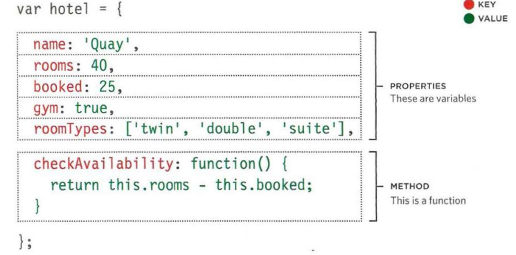
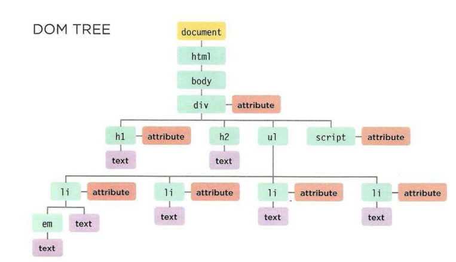

# Object 
**Objects :** is bring together a set of variables and functions to create a model of something that you can recognize from the real world. In an object, variables and functions take new names.

This object represents a hotel. It has five properties and one method. The object is in curly brackets. It is stored in a variable called hotel.

Creating objects using constructor context: On the right, an empty object called hote 1 is created using the constructor function. Once created, three properties and a method are then assigned to the object.

Create and Access Creator Notes: To get a better idea of why you'd want to create multiple objects on the same page, here's an example showing room availability in two hotels. First, the constructor function defines a template for hotels. Next, two different instances of this type of hotel object are created. The first represents a hotel called Quay and the second represents a hotel called Park.

Adding and removing properties: Once an object has been created (using literal notation or a constructor), you can add new properties to it. You can do this using dot notation which you saw to add properties to objects in pl03.

### RECAP: WAYS TO CREATE OBJECTS 
1. LITERAL NOTATION 
var hotel = {} 

hotel .name= 'Quay'; 

hotel .rooms = 40; 

hotel.booked = 25; 

hotel.checkAvailabil ity =function() 

return this.rooms - this .booked; 
} ;

2. OBJECT CONSTRUCTOR NOTATION 

var hotel = new Object();
 
hotel.name = 'Quay'; 

hotel .rooms = 40; 

hotel . booked= 25; 

hotel.checkAvailability =function() 

return this .rooms - this.booked; } ;

3. LITERAL NOTATION A colon separates the key/value pairs. There is a comma between each key/value pair.

var hotel = {

name: 'Quay' ,

rooms: 40,

booked: 25, 

checkAvailability: function() { 

return this.rooms - this .booked; 

} 
} ;

OBJECT CONSTRUCTOR NOTATION The function can be used to create multiple objects. The this keyword is used instead of the object name. 

function Hotel(name, rooms, booked) { 

this.name = name; 

th is.rooms = rooms; 

this.booked = booked; 

this.checkAvailability = function() 

return this.rooms - this.booked; 
} ; 

var quayHotel =new Hotel('Quay', 40 , 25); 

var parkHotel =new Hotel('Park', 120, 77);

An object is a series of variables and functions that represent something from the world around you. In an object, variables are known as properties of the object; functions are known as methods of the object.

# Document Object Model
The Document Object Model (DOM) specifies how browsers should create a model of an HTML page and how JavaScript can access and update the contents of a web page while it is in the browser window.

DOM Tree Model of a Web Page: When a browser loads a Web page, it creates a model for that page. The model is called the DOM tree, and it is stored in the browsers' memory. It consists of four main types of nodes.

WORKING WITH THE DOM TREE: Accessing and updating the DOM tree involves two steps: 

1: Locate the node that represents the element you want to work with. 

2: Use its text content, child elements, and attributes. 

NODELISTS: DOM queries that return more than one element: When a DOM method returns more than one element, it returns a Nodelist (even if it only finds one matching element).

The browser represents the page using a DOM tree. DOM trees have four types of nodes: document nodes, element nodes, attribute nodes, and text nodes. You can select element nodes by their id or cl ass attributes, by tag name, or using CSS selector syntax. Whenever a DOM query can return more than one node, it will always return a Nadel i st. From an element node, you can access and update its content using properties such as textContent and i nnerHTML or using DOM manipulation techniques. An element node can contain multiple text nodes and child elements that are siblings of each other.  In older browsers, implementation of the DOM is inconsistent (and is a popular reason for using jQuery). Browsers offer tools for viewing the DOM tree . 