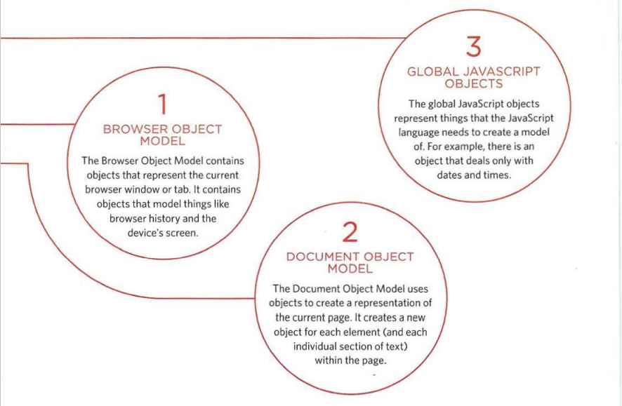

# Domain Modeling
**Domain modeling :** is the process of creating a conceptual model in code for a specific problem. The model describes the different entities, their attributes and behaviors, as well as the constraints that govern the problem domain. An entity that stores data in properties and encapsulates behaviors in methods is usually referred to as an object-oriented model. A well-explained domain model can check and verify the understanding of a particular issue among different stakeholders. As a communication tool, it defines vocabulary that can be used within and between both technical and commercial teams. Define a constructor and initialize properties To define the same properties between many objects, you'll want to use a constructor function.

Here's an implementation of the EpicFailVideo constructor function.

var EpicFailVideo = function(epicRating, hasAnimals) {
    
  this.epicRating = epicRating;
  
  this.hasAnimals = hasAnimals;

}

var parkourFail = new EpicFailVideo(7, false);

var corgiFail = new EpicFailVideo(4, true);

console.log(parkourFail);

console.log(corgiFail);

As you can see, the constructor function is defined using a function expression. In other words, the variable EpicFailVideo is declared and then assigned to a function with two parameters called epicRating and hasAnimals. When the function is called, the data inside these parameters is stored inside the this.epicRating and this.hasAnimals properties respectively. Storing data inside properties ensures that any newly created object can access that data later. After the constructor function is defined, two objects are instantiated using the new keyword and their properties are initialized by calling the EpicFailVideo constructor function. After they are instantiated and initialized, these objects are stored inside the parkourFail and corgiFail variables.

Finally, the two newly created objects are registered to the console.

# Generate random numbers
To model the random nature of user behavior, you will need the help of a random number generator. Fortunately, the standard JavaScript library includes the Math.random() function just for this type of occasion.

var EpicFailVideo = function (epicRating, hasAnimals) {

  this.epicRating = epicRating;
  
this.hasAnimals = hasAnimals;

}

EpicFailVideo.prototype.generateRandom = function(minimum, max) {
  
returns Math.floor(Math.random() * (max - min + 1)) + min;
}

var parkourFail = new EpicFailVideo (7, error),

var corgiFail = new EpicFailVideo (4, true),

console.log(parkourFail.generateRandom(1, 5)) ;

console.log(corgiFail.generateRandom(1, 5)) ;

As you can see, methods can be added to the prototype of a constructor function. Think of the prototype as the stunt doubling of the object. When the scene is too dangerous, you can replace it in the prototype to do the work while the object takes all the glory. More on how this works below. The EpicFailVideo prototype is given a random generation method in which a function is set with two parameters called min and max. The function uses Math.floor and Math.random to compute and return a random integer between min and max. When parkourFail is asked to run the createRandom() method, it searches all of its own methods. When it doesn't find the createRandom() method there, parkourFail looks through all operations on its prototype object. When it finds the createRandom() method on its prototype object, it calls the parkourFail method, passing in 1 and 5 as arguments. It runs a random generate(1, 5) method and returns a random number between 1 and 5. The same process also happens with corgiFail. Although it is certainly more time-consuming to locate a method on the prototype object, this technique is a proven best practice in JavaScript. When a prototype is shared between two or more objects, as with parkourFail and corgiFail, those objects execute the same code when the createRandom() method is called. The shared code means that the running program consumes less memory which is important for devices such as smartphones and tablets.

Domain modeling is the process of creating a conceptual model for a given problem. A well illustrated domain model can verify and validate your understanding of that issue. Here are some tips to follow when creating your own domain forms.

1. When modeling a single entity that will have many examples, build stand-alone objects that have the same attributes and behaviors.
2. Modeling their attributes using a constructor function that defines and initializes the properties.
3. Model their behaviors in small ways that focus on doing one job well.
4. Create instances with the new keyword followed by a call to the constructor function.
5. Store the newly created object in a variable so that you can access its properties and methods from the outside.
6. Use this variable within operations so you can access the object's properties and methods from within.

# Tables
There are several types of information that must be displayed in a grid or table. For example: sports scores, stock reports, and train schedules.

The table represents information in the form of a grid. Examples of schedules include financial reports, television schedules, and sports scores.

## Basic Table Structure
(Table): An element (Table) is used to create a table. The contents of the table are written row by row.

(tr): You indicate the beginning of each row with the opening tag <tr> (tr stands for table row.) and is followed by one or more (td) elements (one for each cell in that row). At the end of the row, you use a closing tag (/tr).

(td): Each cell in the table is represented by a (td) element. (td stands for table data). At the end of each cell, you use a closing tag (/td)

## Table Headings

(th): The (th) element is used just like the (td) element but is intended to represent the address of either a column or a row. (Th indicates the title of the table.)

## Spanning ColumnS
Sometimes you may need table entries to span more than one column. The colspan attribute can be used on a (th) or (td) element and indicates the number of columns a cell should pass through.

The (table) element is used to add tables to a web page. The table plots row by row. Each row is created using an element (tr). Within each row there are a number of cells represented by the element (td) (or (th) if it is a vertex). You can make table cells span more than one row or column by using the rowspan and colspan attributes. For long tables, you can split the table into (thead), (tbody) and (tfoot).

# Functions, Methods, and Objects
Creating objects using constructor context: On the right, an empty object called hote 1 is created using the constructor function. Once created, three properties and a method are then assigned to the object.

Create and Access Creator Notes: To get a better idea of why you'd want to create multiple objects on the same page, here's an example showing room availability in two hotels. First, the constructor function defines a template for hotels. Next, two different instances of this type of hotel object are created. The first represents a hotel called Quay and the second represents a hotel called Park.

Adding and removing properties: Once an object has been created (using literal notation or a constructor), you can add new properties to it. Adding and removing properties: Once an object has been created (using literal encoding or constructor), you can add new properties to it. The first thing you need to do is familiarize yourself with the tools available. You can imagine that your new toolkit has three sections:

An object is a series of variables and functions that represent something from the world around you. In an object, variables are known as properties of the object; Functions are known as object methods. Web browsers implement objects that represent both the browser window and the document loaded into the browser window.
