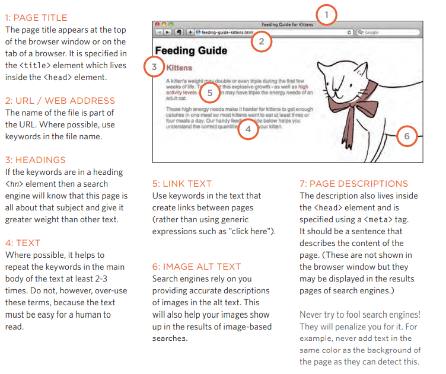

# Images
Control image sizes in CSS: You can control image size using CSS width and height properties, just as you would any other box. Specifying image sizes helps pages load more smoothly because HTML and CSS code are often loaded before images, and lets the browser know how much space to leave for the image to display the rest of the page without waiting for the image to download.

Align Images Using CSS: In the last chapter, I saw how the float property can be used to move an element to the left or right of the containing block, allowing text to flow around it. Instead of using the align attribute of the element (img), web page authors are increasingly using the float property to align images.

## Background Images
background-image: The background image property allows you to place an image behind any HTML element. This page may be the whole or just a part of it. By default, the background image will repeat to fill the entire square.

**Repeating Images, background-repeat and background-attachment :** 
1. repeat : The background image is repeated both horizontally and vertically (the default way it is shown if the background-repeat property isn't used).

2. repeat-x : The image is repeated horizontally only.

3. repeat-y : The image is repeated vertically only.

4. no-repeat : The image is only shown once

5. fixed :The background image stays in the same position on the page.

6. scroll : The background image moves up and down as the user scrolls up and down the page.

You can specify the dimensions of images using CSS. This is very useful when using images of the same size on multiple pages of your site. Images can be aligned both horizontally and vertically using CSS. You can use a background image behind the box created by any element on the page. Background images can only appear once or be repeated across the background of the box. You can create image scrolling effects by moving the background position of the image. To reduce the number of images your browser has to load, you can create gifs.

# Practical Information
Search Engine Optimization :

* The Basics: Search Engine Optimization (or SEO) is the practice of trying to help your site appear near the top of search engine results when people search for the topics your website covers 
* On-Page Techniques: These are the methods you can use on your web pages to improve their ranking in search engines.
* Off-page techniques: Getting other sites to link to you is just as important as on-page technologies. Search engines help determine how your site will rank by looking at how many other sites link to your site. 

On-Page eso : On each page of your website there are seven main places where keywords (words people might search to find your site) can appear in order to improve their findability.

Search engine optimization helps visitors find your sites when using search engines. Analytics tools like Google Analytics let you know how many people visit your site, how they find it, and what they do when they get to it. To put your website on the line, you will need to have a domain name and web hosting. FTP programs allow you to transfer files from your local computer to your web server. Many companies provide platforms for blogging, email newsletters, e-commerce, and other popular website tools (to save you having to write them from scratch).

# Video and Audio APIs
HTML5 comes with elements to embed rich media in documents - (video) and (audio) - which in turn come with their own APIs to control playback and search.
The HTMLMediaElement API provides a wealth of functionality available for creating simple video and audio players, and these are just the tip of the iceberg. See the "See Also" section below for links to more complex and interesting functions.

Here are some suggestions for ways you can improve the current example we created:

1. The time display currently stops if the video is an hour or more long (well, hours will not be displayed; only minutes and seconds). Can you figure out how to change the example to make it display hours?

2. Since (audio) elements have the same functionality as HTMLMediaElement available to them, you can easily make this player work with an (audio) element as well. Try to do so.

3. Can you find a way to turn the inner timer element (div) into a real search bar / trimmer - eg when you click somewhere on the bar, it goes to that relative position in the video playback? As a hint, you can find out the X and Y values ​​of the left/right and top/bottom side of the element via the getBoundingClientRect() method, and you can find the mouse click coordinates via the event object of the click event, called on the document object.

