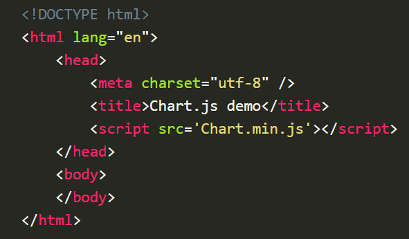
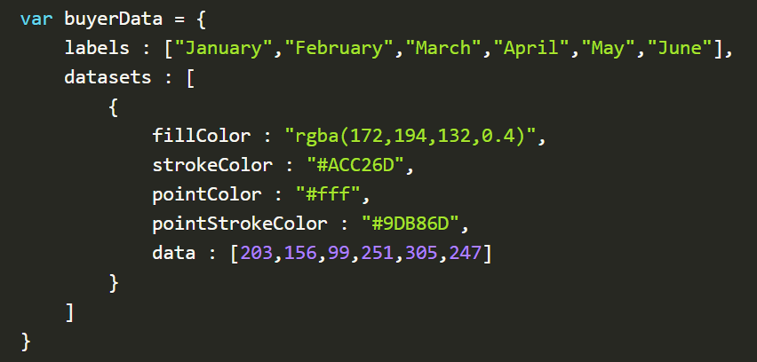
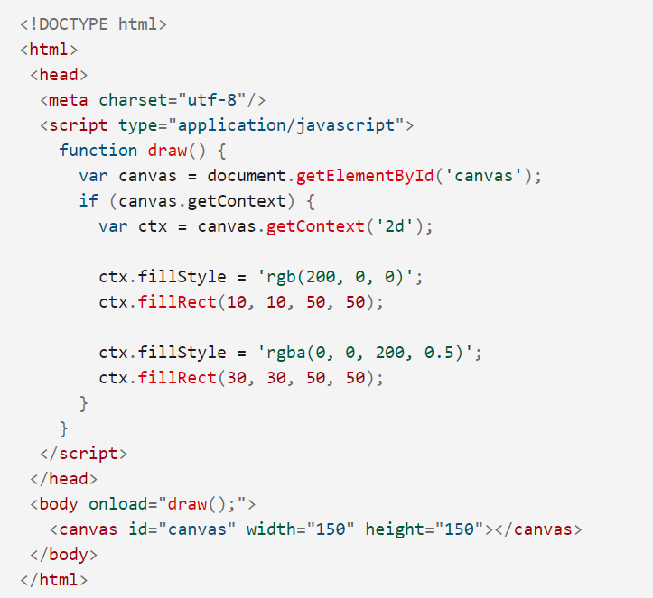

#  This Article
Charts are much better for visualizing data than tables and have the added benefit of no one clicking on them to use as a charting tool. It's easier to look at and transfer data quickly, but it's not always easy to create. Chart.js is a great way to get started with Charts, a JavaScript plugin that uses an HTML5 panel element to draw a graph on a page. It's a well-documented plugin that makes using all kinds of bar charts, line charts, pie charts, and more, very easy. To learn how to use chart.js we will create a set of 3 charts; One will show the number of buyers of the imaginary product over 6 months, and this will be a line chart; The second will show which countries the customers come from, and this will be the pie chart; Finally we will use a bar chart to show the profit during the period.
## Setting
The first thing we need to do is download Chart.js. Copy Chart.min.js from the unzipped folder to the directory you will be working in. Then create a new html page and import the script:

## Drawing a line chart
To draw a line chart, the first thing we need to do is create a canvas element in our HTML where Chart.js can draw your chart. So add this to the body of our HTML page:

**&lt;canvas id="buyers" width="600" height="400"></canvas>**

**Next**, we need to write a script that will retrieve the context of the canvas, so add this to the foot of your body element:

&lt;script>
    
    var buyers = document.getElementById('buyers').getContext
    
    ('2d');
    
    
    new Chart(buyers).Line(buyerData);
&lt;/script>

Within the same script tags, we need to create our data, in this case an object with labels for our graph base and datasets to describe the values on the chart. Add this right above the line starting "var buyers=":

## Draw a pie chart
Our line chart is complete, so let's move on to our pie chart. First, we need a canvas element:
&lt;canvas id="countries" width="600" height="400"></canvas>

## conclusion
You can see a demo of this work here, and if you prefer copy and paste, here's the full text:

&lt;!DOCTYPE html>

&lt;html lang="en">
    
    <head>
       
        &lt;meta charset="utf-8" />
       
        &lt;title>Chart.js demo</title>
       
        &lt;!-- import plugin script -->
        
        &lt;script src='Chart.min.js'></script>
    
    </head>
   
   &lt;body>
        
        <!-- line chart canvas element -->
        <canvas id="buyers" width="600" height="400"></canvas>
        <!-- pie chart canvas element -->
        <canvas id="countries" width="600" height="400"></canvas>
        <!-- bar chart canvas element -->
        <canvas id="income" width="600" height="400"></canvas>
        
   
 </body>

&lt;/html>

## needing these to **Installation:**
You can get the latest version of Chart.js from [npm](https://npmjs.com/package/chart.js), [GitHub versions](https://github.com/chartjs/Chart.js/releases/latest), or use the Chart.js [CDN](https://www.jsdelivr.com/package/npm/chart.js). Detailed installation instructions can be found on the installation [page](https://www.jsdelivr.com/package/npm/chart.js).

## usage of canvas
1.The &lt;canvas> element:

At first glance, it looks &lt;canvas > as element &lt;img> , with the only obvious difference being that it doesn't have src and alt attributes. In fact, an element of &lt;canvas> has only two attributes:
* Display
* Height

Both are optional and can also be set using DOM properties. When the width and height attributes are not specified, the panel will initially be 300 pixels wide and 150 pixels high. The element can be resized randomly by CSS, but during rendering the image is resized to fit the size of its layout: if the CSS size does not respect the proportion of the raw panel, it will appear distorted.

2. Backup content:

The &lt;canvas> element differs from the &lt;img> tag in that, like the &lt;video>, &lt;audio> or &lt;picture> elements, it's easy to select some backup content, to be displayed in older browsers that don't support it, such as Internet Explorer versions older than the version 9 or text browsers. You should always provide backup content for viewing by those browsers.

3. Support Check:

Backup content is displayed in browsers that do not support &lt;canvas>. Scripts can also check support programmatically by testing for the presence of the getContext() method.

## example

# Drawing shapes with canvas
The grid
Before we start drawing, we need to talk about canvas grid or space coordination. Our HTML structure from the previous page contains a canvas element 150px width and 150px high.

Drawing rectangles:
Unlike SVG, the & lt; canvas > only two primitive shapes: rectangles and paths (lists of points connected by lines). All other shapes must be created by merging one or more paths. Fortunately, we have a variety of path-drawing functions that make it possible to create very complex shapes

Drawing paths:
Now let's look at the paths. A path is a list of points, connected by segments of lines that can be of different shapes, curved or not, of different width and different colour. A path can be closed, or even a subpath. To create shapes using paths, we take a few extra steps:

* First, you create the path.
* Then you use the draw commands to draw in the path.
* Once the path is created, you can draw or fill the path to render it.
# Applying styles and colors
Colors So far we've only seen drawing context methods. If we want to apply colors to a shape, there are two important properties we can use: fill Style and strokeStyle.

Transparency:
In addition to drawing opaque shapes on the canvas, we can also draw semi-transparent (or transparent) shapes. This is done either by setting the globalAlpha property or by setting a semi-transparent color for the stroke and/or fill style.

# Drawing text
Drawing text
The canvas rendering context provides two methods to render text:

fillText(text, x, y [, maxWidth])
Fills a given text at the given (x,y) position. Optionally with a maximum width to draw.
strokeText(text, x, y [, maxWidth])
Strokes a given text at the given (x,y) position. Optionally with a maximum width to draw.

Styling text:
In the examples above we are already making use of the font property to make the text a bit larger than the default size. There are some more properties which let you adjust the way the text gets displayed on the canvas:

* font = value

The current text style being used when drawing text. This string uses the same syntax as the CSS font property. The default font is 10px sans-serif.
textAlign = value
Text alignment setting. Possible values: start, end, left, right or center. The default value is start.

* textBaseline = value

Baseline alignment setting. Possible values: top, hanging, middle, alphabetic, ideographic, bottom. The default value is alphabetic.

* direction = value

Directionality. Possible values: ltr, rtl, inherit. The default value is inherit.
These properties might be familiar to you, if you have worked with CSS before.