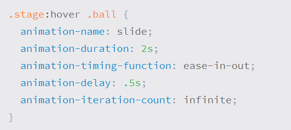
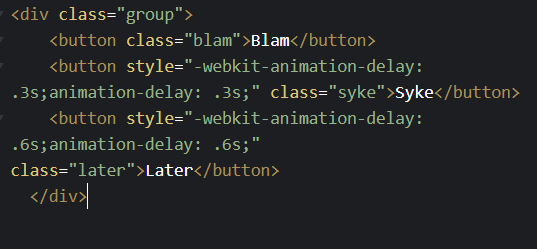

# What Google Learned From Its Quest to Build the Perfect Team
THE WORK ISSUE: REIMAGINING THE OFFICE
1. How to Build a Perfect Team
2. The War on Meetings
3. The Case for Blind Hiring
4. Failure to Lunch
5. The 'Good Jobs' Gamble
6. Rethinking the Work-Life Equation
7. The Rise of White-Collar Automation
8. The Post-Cubicle Office
9. The New Dream Jobs

However, many of today's most valuable companies have realized that analyzing and improving individual workers - a practice known as "employee performance improvement" - is not enough. As commerce becomes increasingly global and complex, the bulk of modern business is increasingly team-based. One study, published in The Harvard Business Review last month, found that "time spent by managers and employees in collaborative activities has increased by 50 percent or more" over the past two decades and that in many companies, more than three-quarters of an employee's day in communicating with colleagues.

Any group can become a team. Sakaguchi's experiments underscore a key lesson from Google's research in teamwork: By adopting a data-driven approach in Silicon Valley, Project Aristotle encouraged emotional conversations and debates about standards among people who might be uncomfortable talking about how they feel. “Google people love data,” Sakaguchi told me. But it's not just Google that loves numbers, or Silicon Valley that eschews emotional conversations. Most workplaces do this. “By putting things like empathy and sensitivity into charts and data reports, it’s easier to talk about,” Sakaguchi told me. "It's easier to talk about our feelings when we can point to a number."

# CSS Transforms
With CSS3, new ways have emerged for positioning and changing elements. Now general layout techniques can be revisited in alternative ways for the size, position, and change of elements. All of these new technologies are made possible thanks to the switching feature.

The transform feature comes in two different settings, 2D and 3D. Each of these comes with its own individual characteristics and values.

Overall, browser support for the transform feature isn't great, but it's getting better every day. For best support, support vendor prefixes are encouraged, but you may need to download the nightly version of Chrome to see all of these transitions in action.

## Transform Syntax
The actual syntax for the transform property is quite simple, including the transform property followed by the value. The value specifies the transform type followed by a specific amount inside parentheses.

div 

{
  
  -webkit-transform: scale(1.5);
     
     -moz-transform: scale(1.5);
       
       -o-transform: scale(1.5);
          
          transform: scale(1.5);
}

## 2D Transforms
Elements may be distorted, or transformed, on both a two-dimensional plane or a three-dimensional plane. Two-dimensional transforms work on the x and y axes, known as horizontal and vertical axes. Three-dimensional transforms work on both the x and y axes, as well as the z axis. These three-dimensional transforms help define not only the length and width of an element, but also the depth. We’ll start by discussing how to transform elements on a two-dimensional plane, and then work our way into three-dimensional transforms.

## Combine transformations
It is common practice to use multiple transformations simultaneously, for example, rotating and scaling the size of an element at the same time. In this case, multiple transformations can be combined together. To combine transform operations, insert the transform values into the transform property one by one without using commas. Using multiple conversion ads will not work, because each ad will replace the above ad. The behavior in this case will be the same as if you were setting the height of an element multiple times.

# CSS Transitions & Animations
One of the developments in CSS3 was the ability to write behaviors for transitions and animations. Front-end developers have been claiming the ability to model these interactions inside HTML and CSS, without using JavaScript or Flash, for years. Now their wish has been fulfilled. With CSS3 transitions, you can change the appearance and behavior of an element whenever there is a change in state, such as when it is moved, focused, activated, or targeted. Animations within CSS3 allow you to change the appearance and behavior of an element in multiple keyframes. Transitions provide a change from one state to another, while the animation can set multiple transition points on different keyframes.

## Transfer timing
The transition timing function property is used to set the speed at which the transition will travel. Knowing the duration from the shift duration feature A transfer can have multiple speeds within a single duration. Some of the most popular keyword values for the linear transition timing function feature include ease of entry, ease, and ease of exit.

.box
 {
  
  background: #2db34a;
  
  border-radius: 6px;
  
  transition-property: background, border-radius;
  
  transition-duration: .2s, 1s;
  
  transition-timing-function: linear, ease-in;

}

.box:hover 

{
  
  background: #ff7b29;
  
  border-radius: 50%;

}

## Customize Animation
Animations also provide the ability to further customize the behavior of the element, including the ability to declare how often the animation is played, as well as the direction in which the animation is completed.

## Repeat animation
By default, the animation runs its cycle once from start to finish and then stops. To get an animation that repeats itself multiple times, the animation-iteration-count property can be used. Animation-iteration-count property values ​​include either an integer or the infinite keyword. Using an integer will repeat the animation as many times as specified, while the infinite keyword will repeat the animation indefinitely in a never ending way.

# 8 SIMPLE CSS3 TRANSITIONS THAT WILL WOW YOUR USERS
1. Fade in
Having things fade in is a fairly common request from clients. It’s a great way to emphasize functionality or draw attention to a call to action.

    Fade in effects are coded in two steps: first, you set the initial state; next, you set the change, for example on hover:

.fade

{

        opacity:0.5;

}

.fade:hover

{

        opacity:1;

}

2. Change color
Animating a change of color used to be unbelievably complex, with all kinds of math involved in calculating separate RGB values and then recombining them. Now, we just set the div’s class to “color” and specify the color we want in our CSS:

.color:hover

{

        background:#53a7ea;

}

3. Grow & Shrink
To grow an element, you used to have to use its width and height, or its padding. But now we can use CSS3’s transform to enlarge.

Set your div’s class to “grow” and then add this code to your style block:

.grow:hover

{

        -webkit-transform: scale(1.3);
        -ms-transform: scale(1.3);
        transform: scale(1.3);
}

4. Rotate elements
CSS transforms have a number of different uses, and one of the best is transforming the rotation of an element. Give your div the class “rotate” and add the following to your CSS:

.rotate:hover

{

        -webkit-transform: rotateZ(-30deg);
        -ms-transform: rotateZ(-30deg);
        transform: rotateZ(-30deg);
}

5. Square to circle
A really popular effect at the moment is transitioning a square element into a round one, and vice versa. With CSS, it’s a simple effect to achieve, we just transition the border-radius property.

Give your div the class “circle” and add this CSS to your styles:

.circle:hover

{
    
            border-radius:50%;
}
6. 3D shadow
3D shadows were frowned upon for a year or so, because they weren’t seen as compatible with flat design, which is of course nonsense, they work fantastically well to give a user feedback on their interactions and work with flat, or fake 3D interfaces.

This effect is achieved by adding a box shadow, and then moving the element on the x axis using the transform and translate properties so that it appears to grow out of the screen.

Give your div the class “threed” and then add the following code to your CSS:

.threed:hover

{

        box-shadow:
                1px 1px #53a7ea,
                2px 2px #53a7ea,
                3px 3px #53a7ea;
        -webkit-transform: translateX(-3px);
        transform: translateX(-3px);
}

7. Inset border
One of the hottest button styles right now is the ghost button; a button with no background and a heavy border. We can of course add a border to an element simply, but that will change the element’s position. We could fix that problem using box sizing, but a far simpler solution is the transition in a border using an inset box shadow.

Give your div the class “border” and add the following CSS to your styles:

.border:hover

{

        box-shadow: inset 0 0 0 25px #53a7ea;
}
8. Swing
Not all elements use the transition property. We can also create highly complex animations using @keyframes, animation and animation-iteration.

In this case, we’ll first define a CSS animation in your styles. You’ll notice that due to implementation issues, we need to use @-webkit-keyframes as well as @keyframes (yes, Internet Explorer really is better than Chrome, in this respect at least).

@-webkit-keyframes swing

{

    15%
    {
        -webkit-transform: translateX(5px);
        transform: translateX(5px);
    }
    30%
    {
        -webkit-transform: translateX(-5px);
       transform: translateX(-5px);
    } 
    50%
    {
        -webkit-transform: translateX(3px);
        transform: translateX(3px);
    }
    65%
    {
        -webkit-transform: translateX(-3px);
        transform: translateX(-3px);
    }
    80%
    {
        -webkit-transform: translateX(2px);
        transform: translateX(2px);
    }
    100%
    {
        -webkit-transform: translateX(0);
        transform: translateX(0);
    }
}

@keyframes swing

{

    15%
    {
        -webkit-transform: translateX(5px);
        transform: translateX(5px);
    }
    30%
    {
        -webkit-transform: translateX(-5px);
        transform: translateX(-5px);
    }
    50%
    {
        -webkit-transform: translateX(3px);
        transform: translateX(3px);
    }
    65%
    {
        -webkit-transform: translateX(-3px);
        transform: translateX(-3px);
    }
    80%
    {
        -webkit-transform: translateX(2px);
        transform: translateX(2px);
    }
    100%
    {
        -webkit-transform: translateX(0);
        transform: translateX(0);
    }
}

# 6 Buttons animated
HTML tags

CSS for Buttons animated
@import url(https://fonts.googleapis.com/css?family=Droid+Sans:700);

		*{
			margin: 0;
			padding: 0;
			box-sizing: border-box;
			transition: all .1s;
		}
		body{
		background-color: #424242;
			font-family: 'Droid Sans', sans-serif;
		}
		.group{
			text-align: center;
			margin: 20px auto;
		}
		.group button{
			margin-top: 10px;
		}

		button{
            
/*			
box-sizing: border-box;*/
			
            background: NONE;
            border: none;
            outline: none;
			border-radius: 3px;
			padding: 15px 70px;
			color:white;
			text-transform: uppercase;
			font-weight: 700;
			text-shadow: 0 1px 3px rgba(0, 0, 0, 0.41);
			box-shadow: 0 3px 0 0 #383838;
			border:3px solid transparent;
			
		
			animation: pulse 1s linear infinite alternate;
			-webkit-animation: pulse 1s linear infinite alternate;
		}
		.active,
		button:active{
			background-image: linear-gradient(rgba(0,0,0,.1) 13%, transparent 13%,transparent);
			box-shadow: 0 1px 0 0 #383838;
			color: rgba(0, 0, 0,.45);
			text-shadow: none;
			
			
			-webkit-animation-play-state: paused; 
    	animation-play-state: paused;
		}
		button:focus,
		button:hover{
			-webkit-animation-play-state: paused; 
    	animation-play-state: paused;
		}
		
		
		.blam:focus,
		.blam:hover{
			background-color:#0097bd;
		}
		.blam{
			background-color:#00bff0;
			border-color: #00bff0;
		}
		
		.syke:focus,
		.syke:hover{
			background-color:#ad4e4e;
		}
		.syke{
			background-color:#e06464;
			border-color:#e06464;
		}
		
		.later:focus,
		.later:hover{
			background-color:#7c8b8f;
		}
		.later{
			background-color:#a8bdc2;
			border-color:#a8bdc2;
		}
		
		@-webkit-keyframes pulse {
			100% {
				transform: translateY(6.9px); 
			} 
		}

		@keyframes pulse {
			100% {
				transform: translateY(6.9px); 
			} 
		}

## CodePen HomeCSS3 Keyframes Animation

@import url(https://fonts.googleapis.com/css?family=Montserrat:700);

body {

  background-color: #ffcc46;

}

::-webkit-scrollbar
 {

    width: 8px;

}

::-webkit-scrollbar-thumb
{

    background: rgba(0,0,0,0.12);

}

::-webkit-scrollbar-track 
{
    
    visibility: hidden;

}

h1 {

  font-family: 'Montserrat', helvetica, arial;

  sans-serif;

  margin: 20px;

}

.exampleDiv 
{
  height: 200px;

  width: 200px;

  border: 1px solid rgba(0, 0, 0, 0.1);

  float: left;

  margin: 20px;

  text-align: center;

  position: relative;

  background-color: #ffffff;

  border-radius: 4px;

}

.ball 

{

  position: absolute;

  height: 20px;

  width: 20px;

  border-radius: 10px;

  background-color: #c0392b;

}

@-webkit-keyframes bouncing 

{
  40%, 70%, 90% {

    bottom: 0;

    -webkit-animation-timing-function: ease-out;

  }
  0% {
    bottom: 200px;

    left: 0;

    -webkit-animation-timing-function: ease-in;

  }
  55% {

    bottom: 50px;

    -webkit-animation-timing-function: ease-in;

  }
  80% {

    bottom: 25px;

    -webkit-animation-timing-function: ease-in;

  }
  95% {

    bottom: 10px;
    -webkit-animation-timing-function: ease-out;

  }
  100% {

    left: 110px;
    bottom: 0;
    -webkit-animation-timing-function: ease-out;

  }
  @-moz-keyframes bouncing {

    40%, 70%, 90% {
      bottom: 0;
      -webkit-animation-timing-function: ease-out;

    }
    0% {
      bottom: 200px;
      left: 0;
      -webkit-animation-timing-function: ease-in;

    }
    55% {
      bottom: 50px;
      -webkit-animation-timing-function: ease-in;

    }
    80% {
      bottom: 25px;
      -webkit-animation-timing-function: ease-in;

    }
    95% {
      bottom: 10px;
      -webkit-animation-timing-function: ease-out;

    }
    100% {
      left: 110px;
      bottom: 0;
      -webkit-animation-timing-function: ease-out;

    }

 # 404

 body {

  margin:0;

  font-family:sans-serif;

  color:#f25252;

  background:#f7f7f7;

}

h1 {

  font-size:11rem;

  position:absolute;

  transform:translate(-50%,-50%);

  margin:0;

}
h1:nth-of-type(1){

  animation: range 4s infinite;

}

h1:nth-of-type(2)
{

  left:50%;

  top:50%;

  animation: size 4s infinite;

}

h1:nth-of-type(3)
{

  animation: range2 4s infinite;
}

@keyframes range 
{
  0%  {left:42%;top:50%;font-size:11rem;}

  25% {left:50%;top:40%;font-size:4.5rem;}

  50% {left:58%;top:50%;font-size:11rem;}

  75% {left:50%;top:60%;font-size:4.5rem;}

  100%{left:42%;top:50%;font-size:11rem;}

}
@keyframes range2 
{
  0%  {left:58%;top:50%;font-size:11rem;}

  25% {left:50%;top:60%;font-size:4.5rem;}

  50% {left:42%;top:50%;font-size:11rem;}

  75% {left:50%;top:40%;font-size:4.5rem;}

  100%{left:58%;top:50%;font-size:11rem;}
}

@keyframes size {
  0%  {font-size:11rem;}

  25% {font-size:26rem;}

  50% {font-size:11rem;}

  75% {font-size:26rem;}

  100%{font-size:11rem;}

}

## f

/* Animation -------------------- */

@keyframes balltransform {

	0% {
		border-radius:50%;
		height:100%;
		width:60%;
	}
	29% {
		height:100%;
		width:60%;
	}
	30% {
		height:50%;
		width:100%;
	}
	40% {
		height:80%;
		width:80%;
	}
	59% {
		height:100%;
		width:60%;
	}
	60% {
		height:50%;
		width:100%;
		border-radius:50%;
		transform:rotate(0);
	}
	100% {
		height:80%;
		width:80%;
		border-radius:0;
		transform: rotate(-180deg);
	}
}

@keyframes ballbounce 
{
	
    /* up */

	0% {
		top:-30%;
		animation-timing-function: ease-in;
	}
	/* floor */
	30% {
		top:80%;
		animation-timing-function: ease-out;
	}
	/* up */
	40% {
		top: 20%;
	}
	/* up */
	45% {
		top:17%;
		animation-timing-function: ease-in;
	}
	/* floor */
	60% {
		top:80%;
		animation-timing-function: ease-out;
	}
	/* up */
	75% {
		top:30%;
	}
	90% {
		top:25%;
		animation-timing-function: ease-in;
	}
	/* floor */
	100% {
		top:110%;
		animation-timing-function:ease-out;
	}
}

@keyframes scalemask 

{
	
    0% {

		mask-size:0%;
	}
	65% {
		mask-size:0%;
	}
	78%,100% {
		mask-size:300%;
	}
}

@keyframes scalemask2 
{
	0% {

		-webkit-mask-size:0%;
	}
	83% {
		-webkit-mask-size:0%;
	}
	100% {
		-webkit-mask-size: 300%;
	}
}

{

	box-sizing:border-box;

}

body 
{

	padding:0;
	margin: 0;

}

/* Ball -------------------- */

.ball {

	width:5rem;
	height:5rem;
	left:50%;
	position:absolute;
	z-index:1;
	margin-left:-2.5rem;
	animation:ballbounce 4s 1s infinite;
	animation-fill-mode:both;
}

.ball:after 
{

	content:" ";
	color:#fff;
	display:block;
	margin:auto;
	border-radius:50%;
	background:#fff;
	width:100%;
	height:100%;
	animation: balltransform 4s 1s infinite;
}

/* Animation containers -------------------- */

.animation 
{

	background:#297acb;
	height:100vh;
	width:100vw;
	position:relative;
	z-index:1;
}

.animation-2,

.animation-3 
{

	position:absolute;
	top:0;
	left:0;
	-webkit-mask-size:0;
	-webkit-mask-image:radial-gradient(circle closest-side,black 0%,black 90%,rgba(255,255,255,0) 92%);
	-webkit-mask-repeat:no-repeat;
	-webkit-mask-position:center center;
	animation-fill-mode:both;
}

.animation-2 
{

	background:purple;
	animation:scalemask 4s 1s infinite;
}

.animation-3 
{

	animation:scalemask2 4s 1s infinite;
}

.animation-2 .ball:after
 {
     
	background: #297acb;
}